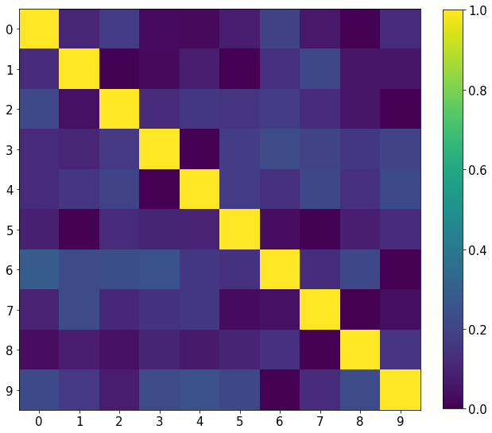
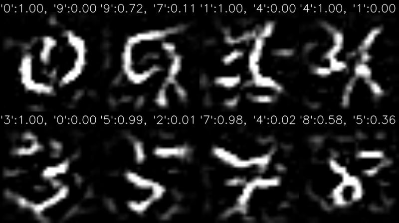

# Zero-shot Knowledge Distillation
This is the code for Zero-shot Knowledge Distillation which is accepted on ICLR2019 oral paper.
Note that it is not exactly the same as the author's algorithm due to a lack of detail in the paper.
So I had to estimate some of the hyper-parameters and implemented detail.
I got better results than the paper's in case of no augmentation. But I fail to increase performance by augmentation.

## Abstract
ZSKD is the knowledge distillation algorithm which not required real data. So they generate "Data Impression" samples which contain the teacher network's knowledge and train student network by it. It means that we don't have to care about privacy or safety. So the pros and cons I think are as follows.

- Pros
  - Simple but powerful algorithm.
  - Data-free training algorithm

- Cons
  - Lack of experiments results of a large dataset such as ImageNet
  - Only focused on a classification task
  - The experiment set is not fair. they use augmentation for ZSKD only. So I think all of the rest performance can be increased.

## Requirements
This code requires

- Tensorflow  1.13
- Python 3.5
- Opencv 3.2.0
- Scipy 1.1.0
- Numpy 1.15.0
- Matplotlib 3.0.0

each version is not important except Tensorflow, I think.

## How to run

Zero-shot knowledge distillation's procedure is composed with 
- Training teacher network, &nbsp;&nbsp;&nbsp;&nbsp;&nbsp;&nbsp;&nbsp;&nbsp;&nbsp;&nbsp;&nbsp;&nbsp;&nbsp;&nbsp;&nbsp;&nbsp;&nbsp;&nbsp;&nbsp;&nbsp;&nbsp;&rarr; train_w_distill.py
- Generate data impression samples, &nbsp;&nbsp;&nbsp;&nbsp;&nbsp;&rarr; Data_Impressions.py
- Training student network by samples". &rarr; train_w_distill.py

But if you want to follow the author's configuration, just run the 
"autotrain.py".

When you train teacher network and generate some samples, you can visualize "Concentration matrix" and generated samples by 
"visualization.py"
below images and tables are my experiment results.

## Experiment results
I tested all the things by running the autotrain. And all of the numerical value is mean of 5 results.

|Rate|Teacher|Student|Soft-logits|ZSKD |
| --:|  :-:  |  :-:  |    :-:    | :-: |
| 100| 99.06 | 98.52 |     -     |  -  |
|  40|   -   |   -   |   89.78   |97.92|
|  25|   -   |   -   |   91.64   |97.35|
|  10|   -   |   -   |   93.08   |96.69|
|   5|   -   |   -   |   88.43   |91.31|
|   1|   -   |   -   |   70.02   |92.15|

   
  <b>Concentrate matrix of teacher network</b>

   
  <b>Expamples of the generated smaples</b>  

 
